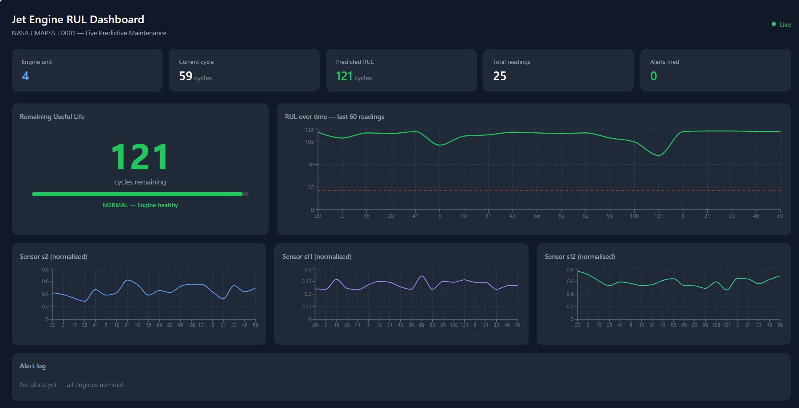
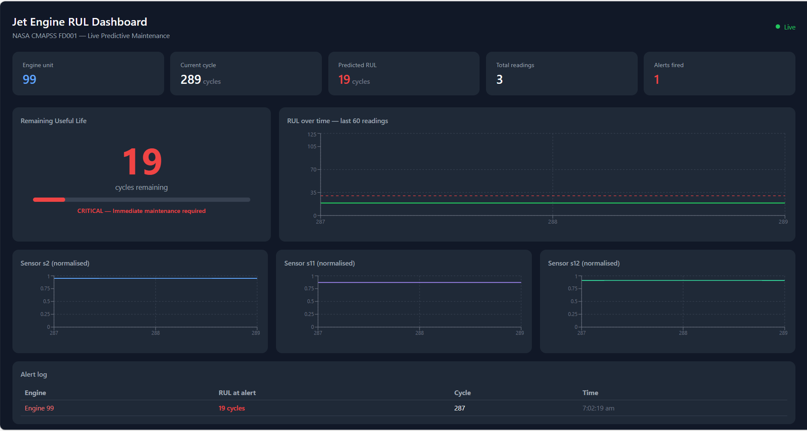
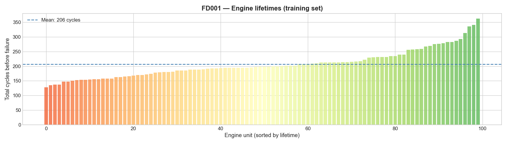
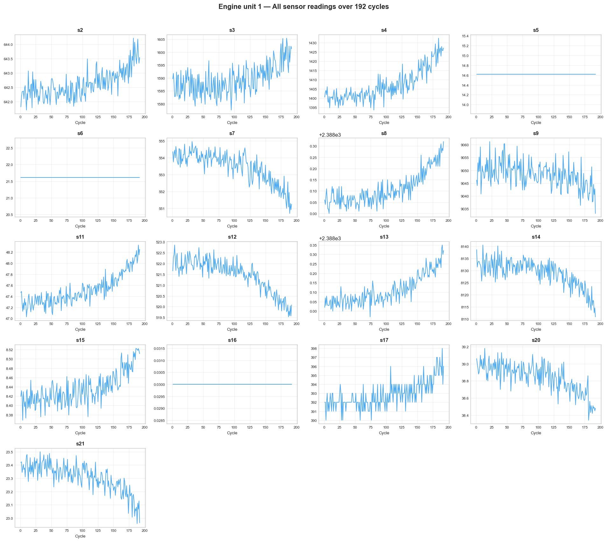
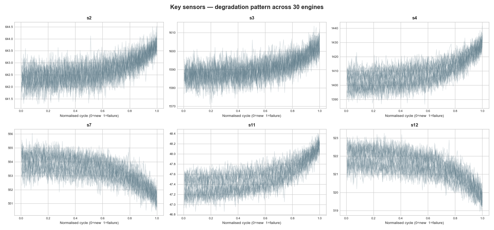
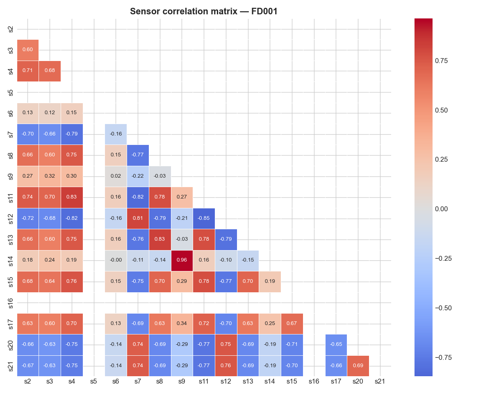
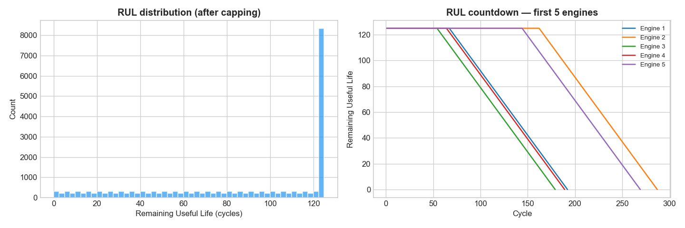
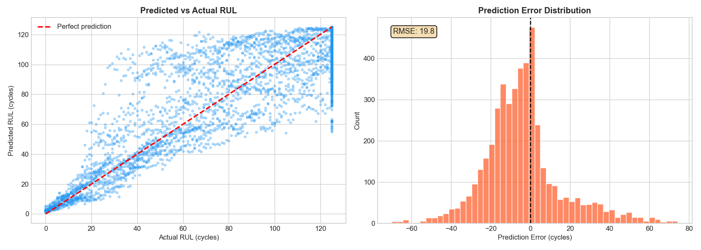
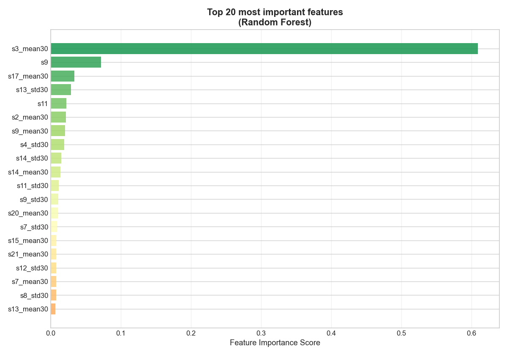

# Predictive Maintenance Dashboard for Aircraft Engines

A real-time machine learning system that predicts when a jet engine will fail — before it actually does.

Trained on the **NASA CMAPSS FD001** benchmark dataset and deployed as a live cloud dashboard on AWS.

---

<table>
  <tr>
    <td></td>
    <td></td>
  </tr>
  <tr>
    <td align="center"><b>Normal operation — engine healthy</b></td>
    <td align="center"><b>Critical alert — failure imminent</b></td>
  </tr>
</table>

---

## Model performance

| Metric | Value | Meaning |
|---|---|---|
| **RMSE** | 19.81 cycles | Average prediction error |
| **MAE** | 14.60 cycles | Median prediction error |
| **R²** | 0.7697 | Model explains 77% of variance |

Competitive with published academic results on CMAPSS FD001 (typical range: 13–25 cycles RMSE).

---

## Data Analysis

### Engine lifetimes — training set

Each bar represents one engine. Red bars failed early (~130 cycles), green bars lasted longest (~360 cycles). The dashed blue line shows the mean lifetime of 206 cycles. This distribution informed the decision to cap RUL at 125 cycles.

---

### Sensor degradation over time

All 14 useful sensors plotted across the full lifetime of Engine 1. Sensors that visibly trend up or down as cycles increase (s11, s12, s4) are the strongest predictors of failure.

---

### Key sensors across 30 engines

The 6 most informative sensors overlaid across 30 engines with normalised cycle axis (0 = new, 1 = failure). Consistent patterns across all engines confirm these sensors reliably capture degradation regardless of individual engine variation.

---

### Sensor correlation matrix

Highly correlated sensor pairs (s13/s15, s4/s8) carry redundant information. This guided feature selection and explains why rolling window statistics added more value than raw sensor readings.

---

### RUL distribution after capping

Left: uniform distribution of RUL values after capping at 125 cycles. Right: RUL countdown curves for 5 engines — the model learns these declining patterns.

---

### Model evaluation — predicted vs actual

Left: scatter plot of predicted vs actual RUL. Points close to the diagonal represent accurate predictions. Right: error distribution centred near zero confirms no systematic bias. RMSE = 19.81 cycles.

---

### Feature importance

Top 20 features ranked by Random Forest importance score. Rolling window statistics (mean and std) dominate the top positions, confirming that temporal trends matter more than instantaneous sensor values.

---

## How it works

NASA CMAPSS data → Python simulator → FastAPI backend → React dashboard
(sensor rows)     (predicts RUL)     (WebSocket)       (live updates)
+ SNS alerts

+ A Python simulator streams jet engine sensor data every 5 seconds. A trained Random Forest predicts the **Remaining Useful Life (RUL)** in cycles. The FastAPI backend broadcasts predictions via WebSocket to a React dashboard, and fires email alerts through AWS SNS when predicted RUL drops below 30 cycles.

---

## Tech stack

| Layer | Tools |
|---|---|
| ML | Python, scikit-learn, pandas, numpy |
| Backend | FastAPI, WebSockets, Uvicorn |
| Frontend | React, Recharts, Vite |
| Cloud | AWS EC2, AWS IoT Core, AWS SNS, Nginx |

---

## Engineering highlights

- **Engine-level train/validation split** — prevents data leakage from temporally adjacent rows
- **30-cycle rolling window features** — rolling mean and std capture degradation trends
- **RUL capping at 125 cycles** — focuses model on the actual degradation zone
- **Live WebSocket streaming** — automatic reconnection with exponential backoff

---

## How to reproduce

```bash
git clone https://github.com/bindhushree-mv/rul-prediction-dashboard.git
cd rul-prediction-dashboard

python -m venv venv && source venv/bin/activate
pip install pandas numpy scikit-learn fastapi uvicorn websockets requests joblib boto3

# Download CMAPSS data from kaggle.com/datasets/behrad3d/nasa-cmaps → place in data/

# Train the model — run notebooks in order
jupyter notebook   # phase1 → phase2 → phase3

# Start all three components (separate terminals)
python backend/main.py
python simulator/simulator_http.py
cd frontend/dashboard && npm install && npm run dev
```

Open `http://localhost:5173`

---

## Future work

- LSTM model for longer temporal dependencies
- SHAP explanations for individual RUL predictions
- Train across all four CMAPSS sub-datasets (FD001–FD004)
- Data drift detection on incoming sensor streams
- AWS SageMaker endpoint with autoscaling

---

## Reference

Saxena, A., Goebel, K., Simon, D., & Eklund, N. (2008). *Damage Propagation Modeling for Aircraft Engine Run-to-Failure Simulation.* IEEE PHM Conference.

